---

 

 

*Desenvolvo pipelines e ferramentas com dados abertos, com   foco em qualidade de dados e automação. Sou entusiasta de   Cyber Security, o que se reflete em projetos com atenção a   privacidade e proteção de dados pessoais.*

 

 

 

 

 

 

 

 

 

---

  

